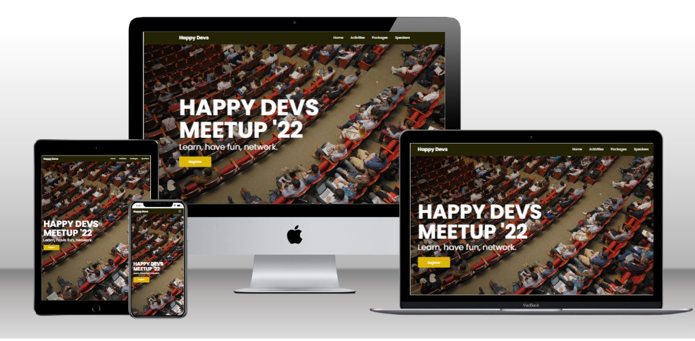

# Happy Devs Meetup 2022

> This is a landing page created for the maiden edition of the Happy Devs Meetup. This website is created with the intent of helping publicity efforts for the meetup.
>
> [Click here to visit website](https://happy-devs.netlify.app/)

## Built With

- HTML
- CSS
- JavaScript

## Live Demo

[Live Demo Link](https://happy-devs.netlify.app/)

## Author

👤 **Benjamin Semah**

- GitHub: [Benjamin Semah](https://github.com/BenjaminSemah)
- LinkedIn: [Benjamin Semah](https://www.linkedin.com/in/benjaminsemah/)
- Twitter: [Benjamin Semah](https://twitter.com/BenjaminSemah)

## 🤝 Contributing

Contributions, issues, and feature requests are welcome!

Feel free to check the [issues page](https://github.com/BenjaminSemah/happy-devs/issues).

## Photo Credit

[Igreja Dimensão on Pexels](https://www.pexels.com/photo/woman-standing-on-stage-with-a-microphone-10401279/)

[Karolina Grabowska on Pexels](https://www.pexels.com/photo/photo-of-a-woman-using-headphones-and-microphone-5399043/)

## Show your support

Give a ⭐️ if you like this project!

## 📝 License

This project is [MIT](./MIT.md) licensed.
